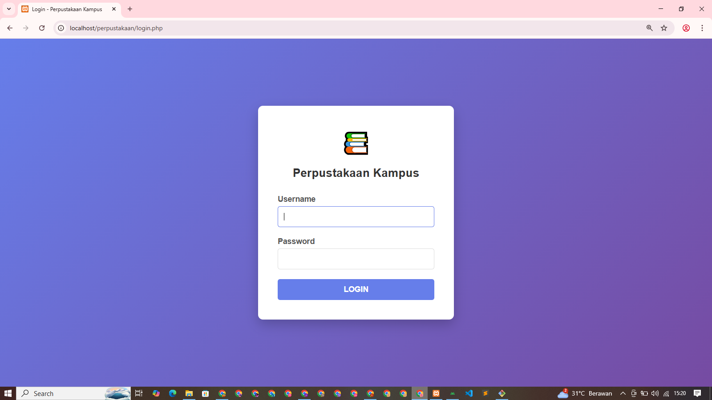
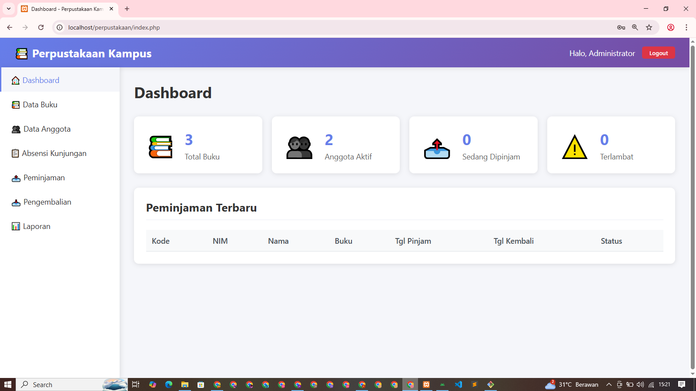
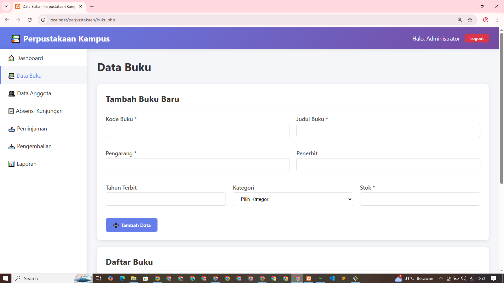
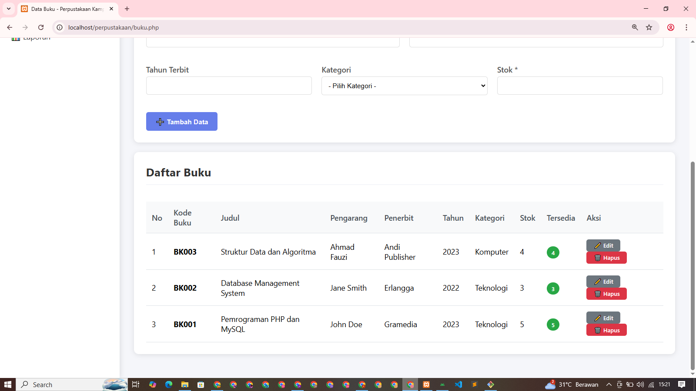
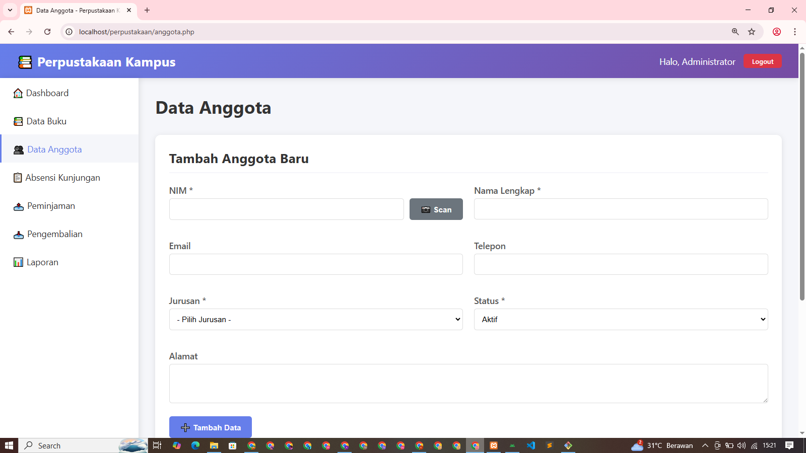
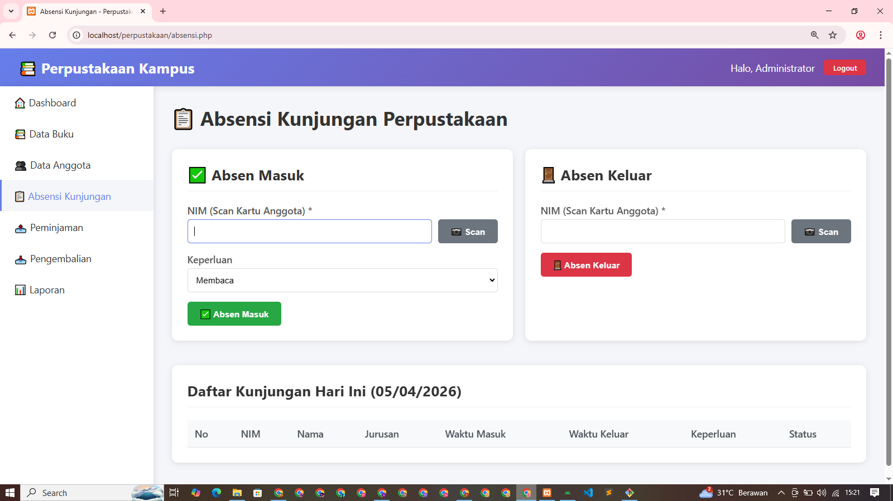
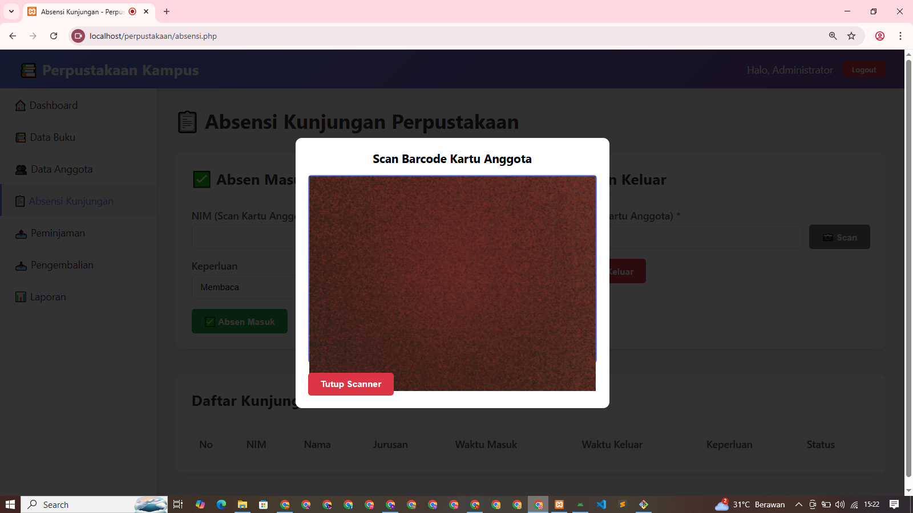
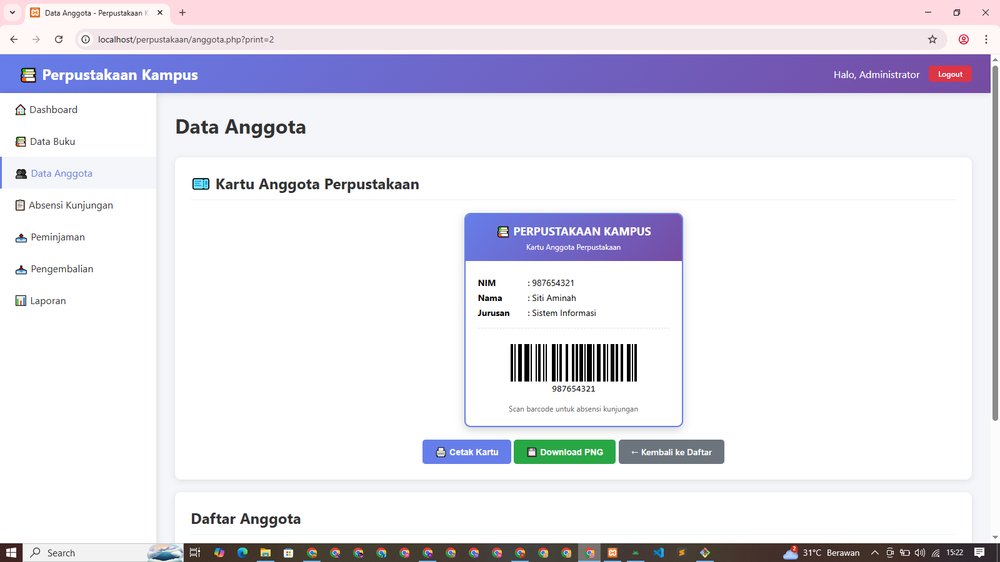
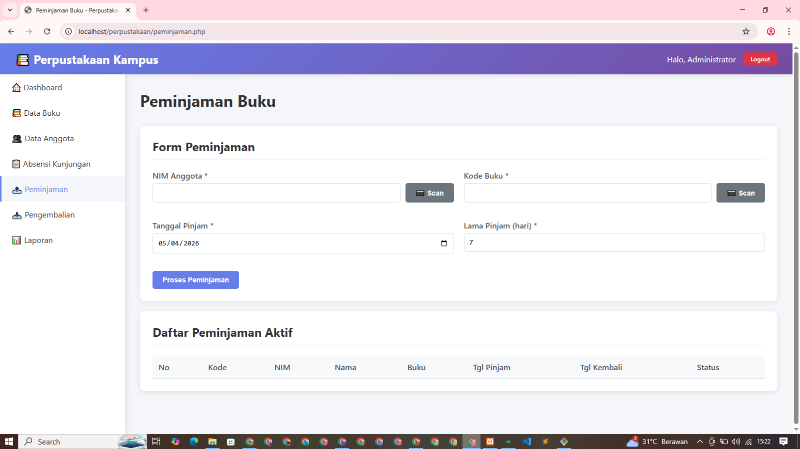
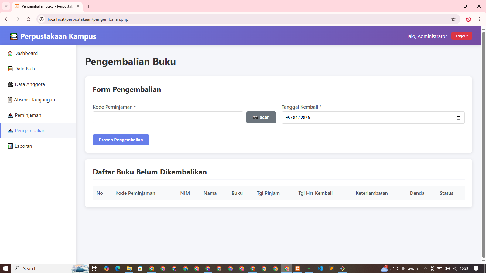

# 📚 Sistem Informasi Perpustakaan (PHP Native)

Sistem Informasi Perpustakaan berbasis web yang dibangun menggunakan **PHP Native** dan **MySQL**. Aplikasi ini dirancang untuk membantu pengelolaan data buku, anggota, transaksi peminjaman, pengembalian, serta laporan perpustakaan secara efisien.

---

## 🚀 Fitur Utama

* 🔐 Login Admin
* 📖 Manajemen Data Buku
* 👥 Manajemen Anggota
* 📥 Peminjaman Buku
* 📤 Pengembalian Buku
* 🧾 Laporan Transaksi
* 🧍‍♂️ Absensi Pengunjung
* 🖥️ Mode Kiosk Absensi

---

## 🛠️ Teknologi yang Digunakan

* PHP Native
* MySQL
* HTML, CSS
* Bootstrap (opsional dari style)

---

## ⚙️ Cara Install

1. Clone repository:

   ```bash
   git clone https://github.com/AdanaTatuyaHatsumi/perpustakaan.git
   ```

2. Pindahkan ke folder:

   ```
   htdocs (XAMPP) / www (Laragon)
   ```

3. Import database:

   * Buka phpMyAdmin
   * Import file: `perpustakaan_kampus.sql`

4. Atur koneksi database di:

   ```
   config/database.php
   ```

5. Jalankan di browser:

   ```
   http://localhost/perpustakaan
   ```

---

## 🔑 Default Login

(Sesuaikan dengan database)

* Username: admin
* Password: (cek di database / generate_password.php)

---

## 📸 Screenshot

<p align="center">
  
   
   
   
   
   
   
   
   
   
</p>

---

## 🎯 Tujuan Project

Project ini dibuat untuk:

* Portfolio developer
* Sistem manajemen perpustakaan sederhana
* Bahan pembelajaran PHP Native

---

## 🤝 Kontribusi

Pull request sangat terbuka untuk pengembangan fitur lebih lanjut.

---

## 👨‍💻 Author

**Kasirun Alfauzi BM Sitorus, S.Kom**
Adana Developer
🌐 https://kasirun-sitorus.my.id

---

## ⭐ Support

Jika project ini bermanfaat, jangan lupa kasih ⭐ di repository ini!
